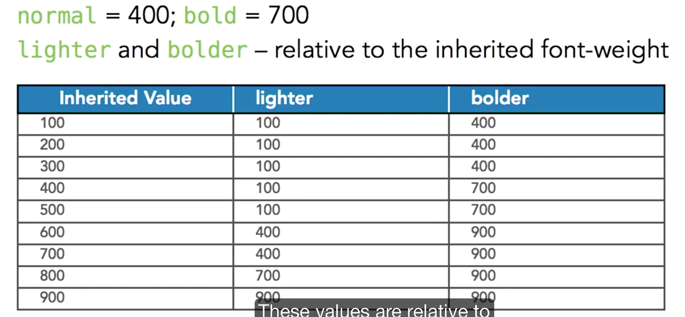
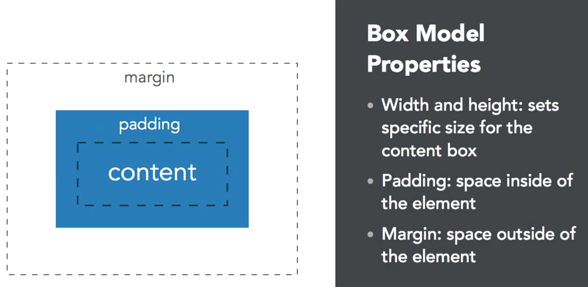
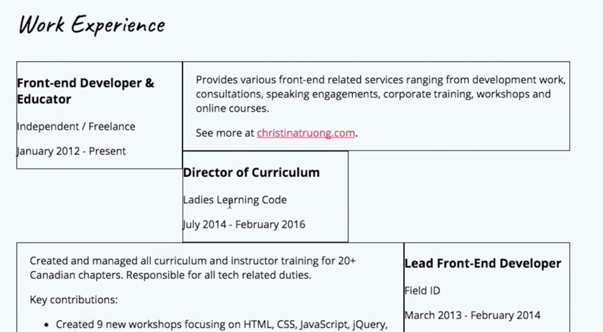

Course Note: CSS Essential 1
============================

Author: Joon Lim


## 1 INTRO

Box Model Properties (content-padding-margin)
- width & height: sets speicific size for the content box
- padding: space inside of the element
- margin: space outside of the element

HTML + CSS + JS = FRONT END


### 1.1 Review of HTML Terminology and Syntax

- Elements - components that define page objects (paragraphs, links, etc)
- Tags - define the elements with angled brackets wrapped around the tag name and usually come in pairs

```html
<tagname>content goes here</tagname>

<p>this is a paragraph</p>
```

- void/self-closing elements - don't have closing tags and don't wrap any content because they are the content. 

```html
<area>, <base>, <br>, <col>, <embed>, <hr>, , <input>, <keygen>,
<link>, <menuitem>, <meta>, <param>, <source>, <track>, <wbr>
```

### 1.2 Document Object Model

The document object model (DOM) represents the tree-like structure, created when writing HTML. Each element is an object, which makes up the document. 


## 2 Referencing CSS

### 2.1 External CSS

- a separate CSS file with a .css file extension
- always referenced within the `<head>`
- Uses the `<link>` and two attributes, *rel* and *href*

```html
<link rel="stylesheet" href="style.css>"
```

### 2.2 Inline CSS

- a technique that should be avoided because it's inefficient.
- Inline CSS is added using the *style* attribute.

```html
<p style="color: blue;"> this text is blue. </p>
```

### 2.3 Internal CSS

- Internal CSS uses the `<style>` tag, included in the `<head>` element.
- Internal CSS will take precedence, only if it's added after the external stylesheet.


```html
<head>
	<title>Page Title</title>
	<style>
		p {
			color: blue;
		}
	</style>
</head>
```


### 2.4 File Naming Tips

- Don't use spaces or symbols and separate words with dash or underscore.
- Use concise and descriptive names

e.g.
```
product-services.html (best for SEO)
product_services.html
```

### 2.5 Folder Directory Example

```
project-name
  	|-- css/
  		|-- style.css
	|-- images/
		|-- profile.jpg
	|-- fonts/
		|-- museo-sans.ttf
	|-- index.html
```

### 2.6 Relative Paths

Relative paths point to files located within the project folder, including subfolders if applicable.

### 2.7 Absolute Paths

- Absolute paths refers to a resource located on a server including the domain name.
- They are often used when linking to pages outside of your website.

```html
<a href="http://linkedin.com">LinkedIn</a>
````

## 3 CSS: Cascading Style Sheets

- Used to separate presentation (CSS) from content (HTML)
- Replaces old, deprecated HTML presentational tags (i.e., `<blink>` and `<center>`)

### 3.1 CSS Terminology and Syntax

- **Selectors** determine which HTML element to apply styles to. 
- **Declaration blocks** consists of one or more styles rules, enclosed in curly braces {}.
- **Declarations** are style rules, written in **property:value;** pairs.
-- **properties** determine the type of the style.
-- **values** are specific to the property and vary depending on the property.

```html
selector {
	property:value;
}
```

### 3.2 Formatting CSS

- Use whitespaces to make the CSS easier to read

### 3.3 CSS Selectors

#### Type Selectors

Type selectors match the HYML by using the element name.

```html
h1 {}
```

#### Class and ID Attributes

Class and ID attributes are used to attach extra information to HYML elements.

- IDs (#) can only be used once per page!
	- ID attribute can be used for the in-page link.
- The same class (.) can be used multiple times per page.

```html
<tag attributes="value"></tag>
<p class="example"></p>
<div id="example"></div>
```

### 3.4 Pseudo-class Selectors

#### Descendent Selectors

- Use multiple selectors, separated by a space, to match the descendant elements
- Avoid going more than 3 levels deep!

```html
<p>paragraph with a <a href="#placeholder">link</a>.</p>

p a {
	/* will only select links inside of a paragraph */
}
```

#### Grouping Multiple Selectors

```html
h1, h2, h3 {
	color: red;
}
```

#### Pseudo-class Selectors

- Pseudo-class selectors specify a state of the element.
- Keywords are combined with another selector, using a colon. 

```html
a:hover {
	color: black;
}

<a href="http://website.com">link</a>
```


### 3.5 CSS Comments Syntax

```css
/* comment here 
--------------------*/
```


### 3.6 CSS Color Values

Referece: 
1. [coolers.co](http://coolers.co): color pallete lookup
2. [randoma11y.com](http://randoma11y.com): accessibility-focused color lookup

- RGB: rgb(245, 245, 245)
- hex: #FFFFFF

### 3.7 Cascading Style Sheets

- CSS rules cascade and are executed from top to bottom.
- Styles **can** be inherited from ancestor to descendant elements. 


### 3.8 CSS Specificity

Specificity determines which CSS rule will take precedence. The selector with the higher specificity will be applied.

```css
h1 {
	color: #222222;
}
.classname {
	color: blue; /* higher specificity ranking */
}
```

#### Specificity Rankings

ID (100) > Class (10) > Type (1)

Reference: 
1. [cssspecificity.com](http://cssspecificity.com)
2. [specificity.keegan.st](http://specificity.keegan.st)


## 4 Typography

- **Typography**: the study of the design and use of the type for communication
- **Typeface**: a set of fonts, designed with common characteristics and composed of glyphs
- **Font**: inidividual files that are part of a typeface

### 4.1 Typefaces and CSS

Use **font-family** to set the typeface

Recommended to add single or double quotes around font families with spaces in their names

```css
body {
	font-family: 'Helvetica Neue';
}
body {
	font-family: "Helvetica Neue";
}
```

Web-safe Fonts - preinstalled fonts.

### 4.2 Using a Font Stack

```css
h2 {
	font-family: 'Helvetica Neue', Arial, sans-serif;
}
```

- Choose similar fonts
- Use commas to separate each option
- Use a generic font family as the last option
- Always declare generic fonts without quotes

### 4.3 Generic Font Options

1. Serif (serif fonts)
2. Sans serif (san serif fonts)
3. Cursive (script or decorative fonts)
4. Fantasy (decorative fonts)
5. Monospace (monospace fonts)

### 4.4 @font-face

Used to set the font name and link to the font files

```css
@font-face {
	font-family: 'Museo Sans';
	src: url(../fonts/museo-sans.ttf);
}

body {
	font-family: 'Museo Sans', Arial, sans-serif;	
}
```

Different browsers support different file formats. The WOFF & WOFF2 formats are supported by mordern browsers.

```css
@font-face {
	font-family: 'MuseoSans';
	src: url(../fonts/museo-sans.woff2) format('woff'),
		 url(../fonts/museo-sans.woff) format('woff');
}
```

### 4.5 External Fonts (Web Fonts)

- adobe typekit (paid service)
- google fonts (free)

```html
<link href="https://fonts.googleapis.com/css?family=Open+Sans" rel="stylesheet">
```

```css
body {
	font-family: 'Open Sans', sans-serif;
}

```

2-3 fonts are generally used.

### 4.6 Font Size

#### px

- Measure screens in pixels
- Absolute value; great for accuracy
- Use whole numbers and avoid decimals
- Browser default = 16px

#### em

- named after the letter "m"
- releative unit (1em = 1x; 1.5em = 1.5x)
- 1em = inherited font-size
- if no font-size is declared, 1em = default = 16px

#### rem

- newer unit, which is similar to "em"
- if no font-size is declared, 1rem = 1em = default = 16px
- relative unit but only to the root element (HTML)
- gives you the same flexibility as "em" with a more straightforward approach

#### cm

One centimeter. 1cm = 10mm = 37.8px

### 4.7 CSS Font Properties

#### font-weight

- font-weight is the thickness or boldness of typefaces.
- Number values are 100,200,300,400,500,600,700,800,900
- Number values will map to the nearest typeface available.
- normal = 400; bold = 700; lighter; bolder

```css
h1 {
	font-weight: 400;
}
```



#### font-style

- three values: italic, oblique, normal

```css
p {
	font-style: italic;
}
em {
	font-style: normal;
}
```

### 4.8 color

```css
h1 {
	color: black; /* keyword */
	color: #000000; /* hex code */
	color: rgb(0,0,0) /* rgb */
}
```

### 4.9 line-height

- the **line-height** property sets the height of the space between two lines of text.
- it is closely related to font-size.
- it can use different value types: px, %, ems, rems, or unitless.
- suggest to use a relative unit.

IMPORTANT: line-height should be larger than the font-size.

### 4.10 text-transform

the **text-transform** property specifies the latter casing.

- text-transform: Capitalize;
- TEXT-TRANSFORM: UPPERCASE;
- text-transform: lowercase;
- text-transform: none;

### 4.11 text-align

- The **text-align** property can be used to center align text. 
- You can add it to the HTML element itself or the parent element. 
- This style is inherited by descendant elements.


## 5 Layout

### 5.1 HTML Elements

#### Block Elements

- height = content
- width = 100% of container
- elements start on a new line
- block elements can wrap other block and inline elements.
- examples: `<div>`, `<p>`, `<h1>`

#### Inline Elements

- Height and width = content
- elements align left, in a line.
- inline elements can only nest other inline elements (except `<a>` tags in HTML5).
- exmaples: `<a>`, `<span>`, `<strong>`

```css
span, a {
	display: block; /* inline elements now behave like block elements
}
```

**display option: inline, block, inline-block, none**

### 5.2 Box Model



- width, height, padding, margin, boarder

#### Length Values

- measurement units are used with many properties, such as font-size, line-height, and the box model properties.
- pixels (px) are fixed sizing and offer more control.
- percentages (%) are used to size elements relative to the containing element.

#### Height and Width

The width and height properties are used to change the default size of block and inline elements.

```css
/* inline element */
span {
	width: 100px;
	height: 100px;
	display: block;  /* inline elements require display property */
	/* OR */
	display: inline-block
}

/* block element */
div {
	width: 100px;
	height: 100px;
}
```

Padding is also used to adjsut the space inside of the element.

```css
/* longhand */
span {
	padding-top: 2px;
	padding-right: 2px;
	padding-bottom: 2px;
	padding-left: 2px;
}

/* shorthand */
span {
	padding: 2px /* same for all sides*/
	padding: 2px 10px /* 2px for top & bottom, 10px for left & right */
	padding: 1px 10px 5px /* 1px for top, 10px for right & left, 5px for bottom */
	padding: 2px 2px 2px 2px; /* top right bottom left - clockwise */
}
```

#### Margin

Margin adjusts the space around/outside of an element.

```css
/* longhand */
margin-top: 2px;
margin-right: 2px;
margin-bottom: 2px;
margin-left: 2px;

/* shorthand */
margin: 2px
margin: 2px 10px
margin: 2px 10px 5px
margin: 2px 10px 5px 2px
```

* by default, block elements stack on top of each other.
* Negative margin values are used to move elements outside of the stacking position.

```css
margin: -20px 0 0 -20px;
```

* Margin and auto-align

```css
div {
	width: 950px;
	margin: 0 auto;
}
```

#### Border

the border property displays between the margin and padding.

```css
/* lognhand */
border-width: 2px;
border-style: solid; /* dashed, solid, dotted, double, none */
border-color: red;

/* shorthand */
border: 2px solid red; /* width, style, color */
```

#### creating a content wrapper

```css
.content-wrap {
	max-width: 950px;
	margin: 0 auto;
}
```

#### Float

```css
.floated {
	float: left;
	margin-right: 15px;
}
.next {
	clear: both; /* left and right */
}
.parent {
	overflow: hidden;
	/* OR */
	overflow: auto;
}
```

### 5.3 Paul Irish's Box Model Fix

- put it on the very top of the script
- we can modify the box without worrying about the wrapper size

```css
html {
	box-sizing: boarder-box;
}
*, *:before, *:after {
	box-sizing: inherit;
}
```

### 5.4 min-height property trick

Use avoid the following situation:



```css
min-height: 175px; /* adjust based on your content */
```


## 6 Note

"background" is a shortcut for 
```
background-color
background-image
background-position
background-repeat
background-attachment
background-clip
background-origin
background-size
```