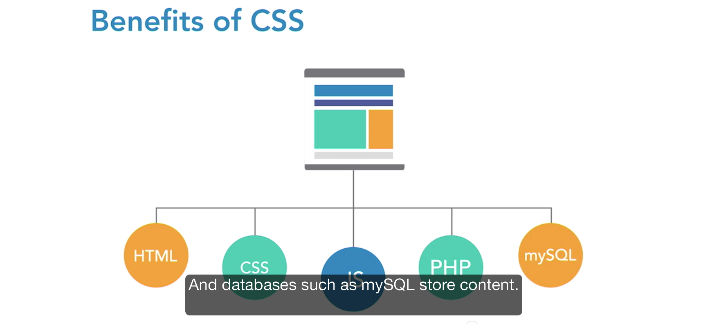
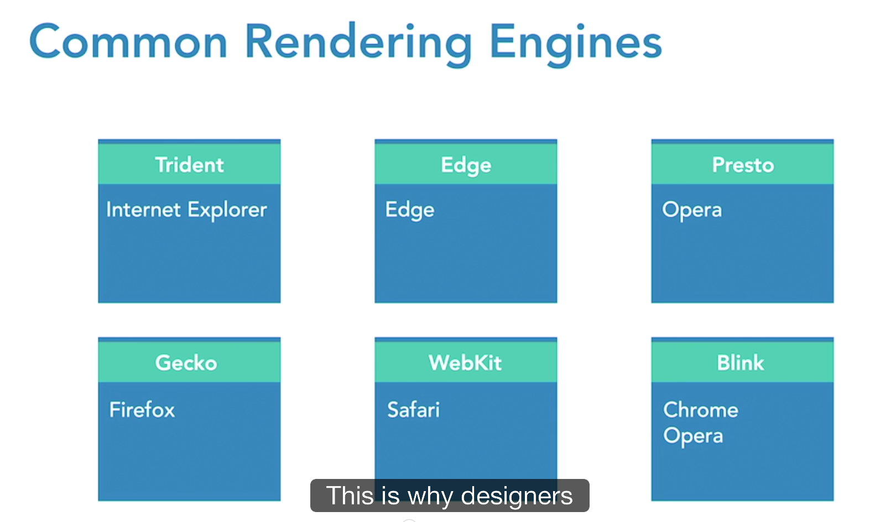

Course Note
===========

The course focuses on the big picture of Cascading Style Sheets.

- HTML: backbone of the buidling
- CSS: skin of the building
	- CSS controls the look and feel.




# Benefit of User Control

- Giving the user control enhances accessibility.
- It prvents rendering issues from restricting access to content.
- Users with disabilities can override smaller text sizes.
- On the web, being able to access content matters.


# CSS Syntax

Selector & Decoration

- Selector
	- Element Selector
	- Class Selector
	- ID Selector
	- Element-specific Selectors
	- Descendent Selectors
	- Grouping Selectors


# Guidelines for Writing HTML

- Focus on writing clean, efficient code
- Structure the HYMK  so it addes meaning to the content
- Don't focus on styling when initially strcuturing code
- Much easier to style well-structure code


# CSS Authoring Options

- Style Location
	- External Style
	- Embedded Style
	- Inline Style
		- discouraged as it's inefficient.

- Authoring Considerations
	- Most projects wil rely heavily on external css files
	- Embedded styles are mainly used to overwrite external styles.
	- You should plan an overall site strategy for style placement


# How brwosers apply styles

- Search Order: browsers are reading selectors from right to left.
- Cascade: external styles are applied first, then embedded, then inline. And the last rule applied wins.
- Inheritance: child rules always overwrites the parent rules where there is a conflict.
- Specificity: more specific rule wins. Id = 100, class = 10, element = 1.
- Styles are cumulative.


# Common Rendering Engines




# CSS Specifications

- [https://www.w3.org/Style/CSS/](https://www.w3.org/Style/CSS/)
- [http://caniuse.com](http://caniuse.com) - check the browser support for different browsers.
- [http://www.quirksmode.org](http://www.quirksmode.org) - check the compatibility


# Common CSS Concetps

## Work with Fonts

- System Fonts
- Web Fonts

### Requesting Fonts

```css

h1 {
	front-family: Arial, Helvetica, Verdana, Sans-serif;
}

```

- evaluates from left and move onto right if unavailable. 

### CSS Font Options

- Allow the browser to display its default font
- Specify a system font and provide fallback options
- Use @font-face to point to a hosted font resource

## Formatting Text

### Defining Font Families

```css
body {
	font-family: Georgia,
	"Times New Roman", Times, serif;
}
```

### Defining Font Size

```css
h1 {
	font-size: <absolute-size> | <relative-size> | <length> | <percentage> | Inherit
}

```

Fixed Units vs. Relative Units

- Fixed units are displayed at the requested size, regardless of device or context.
- Relative units are displayed relative to the environment in which tey are found.

### Font-Weight and Font-Style

```css
h1 {
	font-weight: normal|bold|bolder|lighter|100|200|300|400|500|600|700|800|900|inherit;
	font-style: normal|italic|oblique|inherit
}

```

### Font-Variant & Text-transform

```css

h2 {text-transform: uppercase;}

h3 {font-variant: small-caps;}

```

### Text-align & Text-indent

```css
p {text-align: justify;}

.quote {text-align: center;}

p {text-indent: 1em;}

```

### Letter-spacing & Letter-height

```css
h2 {letter-spacing: .1em;}

p {line-height: 1.6;}
```

### The Box Model

The box model refers to the physical properties of an element's rectangular box. Tehse are margins, boarders, paddings, and tent width and height.

- margin
- border: border-width, boarder-style, border-color
- padding: padding, padding-top, padding-right, padding-bottom, padding-left
- width and height
- box-sizing: content-box, border-box

Box Model Considerations

- If a proerpty is not declared, you can't assume the value is 0.
- Elements aoften have default margins that you need to account for.
- A 100% width property when combined with padding and borders can create elements that are larger than their parents.

### Margins and Paddings

Padding Syntax

```css
p {
	padding: 10px 20px 15px 10px;
	padding: 10px 20px 15px;
	padding: 10px 20px;
	padding: 10px;
}

```

Margin Syntax

```css
p {
	margin: 10px 20px 15px 10px;
	margin: 10px 20px 15px;
	margin: 10px 20px;
	margin: 10px;
}
```

### Borders

Border Syntax

```css
div {
	border-top: 1px solid black;
	border-right: 1px solid black;
	border-bottom: 1px solid black;
	border-left: 1px solid black;

	border: 1px solid black;
}
```

- Border Styles: solid, dotted, dashed, double, groove, ridge, inset, outset
- Border color: border-color

### Background

```css
div {
	background-color: #ff0;
	background-image: url(flower.png), url(ball.png), url(grass.png)
	background-position: center center, 20% 80%, top left;
	background-origin: border-box, content-box, border-box;
	background-repeat: no-repeat, no-repeat, no-repeat;
}
```

### Working with color

- border-color: red;
- background-color: #fff;
- color: rgb(255, 128, 0);
- opacity: rgba(247, 235, 185, .5);

### Element Positioning

- normal document flow
- position: static|relative|absolute|fixed|inherit
-Element Stacking: z-index

### Floating

```css
.box 1 {float: left;}
```

### Media Query Syntax

link element syntax

```html
<link rel="stylesheet" type="text/css" href="style.css" media="screen">
```


## CSS Resources

### Popular CSS Frameworks

Pre-prepared CSS files that provide a templating system for site slayout and design.

- boostrap from twitter
- pure.css from yahoo
- foundation
- base
- normalize.css


### CSS Preprocessor

to define variables, nested rules, mixins and operators.

- LESS
- SASS
- STYLUS


