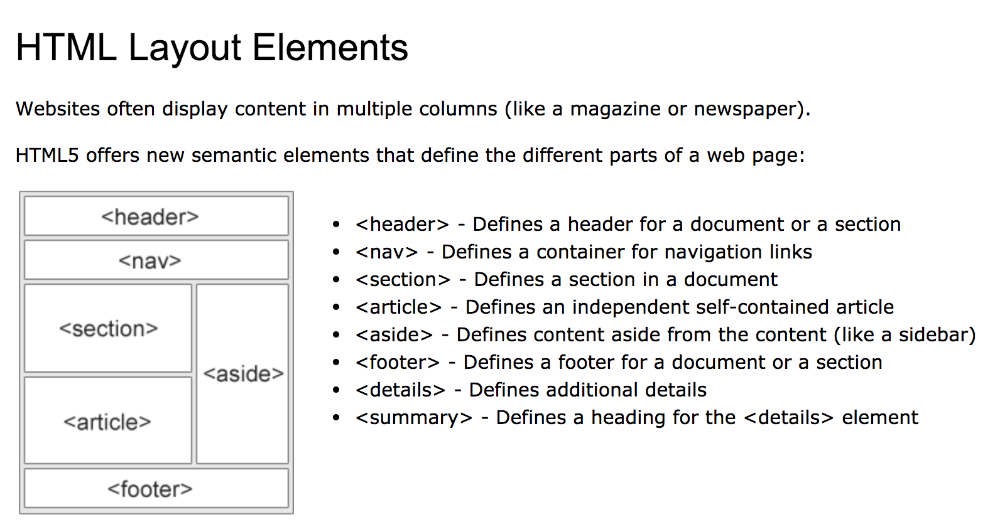

Course Note: HTML Structure, Syntax, Semantics
==============================================

Author: Joon Lim

## 1 Intro

### 1.1 Semantics

The process of adding meaning through language. Web Semantics is the process of using web languages and syntaxes to add meaning to content.

- Improving semantics was as speicific focus of HTML5
- New semantic elements expand markup capabilities
- New document outline rules enhance document structure
- New content models give context for when certain

**Bookmark and lookup for W3's HTML elements.**

### 1.2 HTML Content Models

Block level vs. inline level

## 2 HTML5 Document Structure

A series of sections and subsections that can be visualized as a document outline.

- Sectioning Elements: article, aside, nav, section
- Semantic Grouping Elements: footer, header, main

### 2.1 Organizing Content

Outline based on Primary Content vs. Secondary Content

### 2.2 Creating Document Section

1. create document section
2. identify main content
3. add headings properly
4. build navigation
5. properly nesting structure
6. structure headers and footers
7. check document structure


```html
<!doctype html>
<html lang="en">
<head>
    <meta charset="utf-8">
    <title></title>
</head>
<body>
    <header>
        <h1></h1>  <!-- #3 -->
        <nav></nav>  <!-- #4 -->
    </header>
    <main>  <!-- #2 -->
        <h2></h2>
        <article>
            <header>  <!-- #6 -->
                <h3></h3>  <!-- #5 -->
                <p></p>
            </header>
                <h4></h4>
            <section>
                <h3></h3>
            </section>
        </article>
    </main>
    <section></section>
    <aside></aside>
    <footer></footer>  <!-- #6 -->
</body>
</html>
```

#### 8. Sectioning Roots

use `blockquote` to make the internal structure without making the change on the document outline.

## 3 Grouping Content with HTML 5

### 3.1 Figure and Figcaption

use to wrap an image content.

```html
<figure>
    <figcapture>image title</figcapture>
    
</figure>
```

### 3.2 Using divs

Are you grouping content together that there is no suitable element for? If yes, then **div** might be a good candidate.

### 3.3 working with lists

- ordered list, `<ol>`
- unordered list, `<ul>`
    - list item, `<li>`
- definition list, `<dl>`
    - definition term, `<dt>`
        - definitions, `<dd>`

### 3.4 Emphasizing text

```html
<b></b>
<i></i>
<strong></strong>
<em></em>
```

## 4 Extending Meaning


## 5 HTML5 Layout



Link: [https://www.w3schools.com/html/html_layout.asp](https://www.w3schools.com/html/html_layout.asp)

## 6 HTML5 Template

```html
<!doctype html>
<html lang="en">
<!--Only the head and body elements are supposed to be direct descendants of the html element. All others should be descendants of either the head or body-->

<head>
    <meta charset="utf-8">

    <!--The head element must be a direct descendant of the html element-->
    <!--The head element is a very busy place for most websites, so we've created a tutorial to walk you through the different elements and tasks accomplished in the head element. You can find it at the following address: https://html.com/document/metadata/ -->

    <title>Your Webpage Title Goes Here</title>
	<meta name="description" content="The HTML5 Herald">
	<meta name="author" content="SitePoint">

	<link rel="stylesheet" href="css/styles.css?v=1.0">

</head>

<body>
    <!--The body element contains the full visible content of the web page-->
    <header>
        <!--The header typically includes your logo, tagline, and may contain a nav element-->
        <nav>
            <!--The nav element isn't used for every single link but for navigational menus-->
        </nav>
    </header>
    <main>
        <!--The main element cannot be used inside of anything other than the body element. It is intended to hold the main content of the page.-->
        <nav>
            <!--You can use a nav element just about anywhere-->
        </nav>
        <article>
            <!--If your web page contains a blog post or news article it makes sense to wrap the whole article in article tags-->
            <aside>
                <!--The aside tag can be used within an article or outside of it. It is used to mark content that is related but not central to the main content of the page-->
            </aside>
            <section>
                <!--Sections are used to seperate major parts of an element, such as chapters of an HTML ebook, or to cordone off the comments section from the rest of the main element-->
            </section> 
            <address> 
            	<!--An address element inside of an article element is used to provide contact info for the author of the article--> 
            </address> 
        </article>
        <aside>
            <!--The aside element would also be used to mark a sidebar if used outside of the main element-->
            <section>
                <!--Within a sidebar you could use section elements to identify the different parts of the sidebar. For example, you could put adds in one section, related posts in a second section, and a newsletter signup form in a third section element.-->
            </section>
        </aside>
    </main>
    <footer>
        <!--The footer typically contains links to things like About Us, Privacy Policy, Contact Us and so forth. It may also contain a nav, address, section, or aside element.-->
        <address> 
        	<!--Put an address element in the footer and you're indicating that the contact info within the element is for the owner of the website rather than the author of the article.--> 
        </address> 
    </footer>
    <script src="js/scripts.js"></script>
</body>

</html>
```